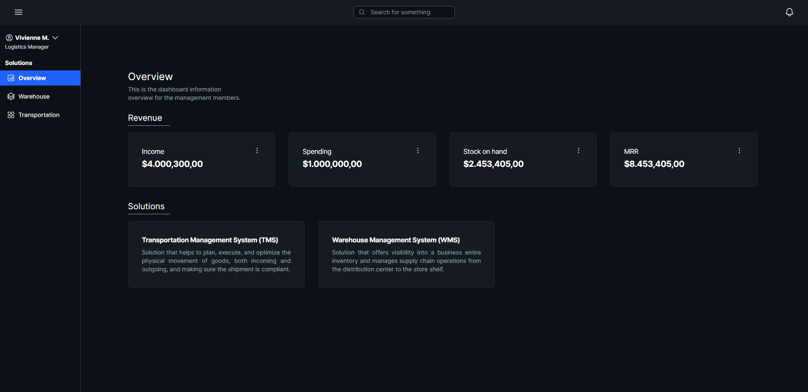
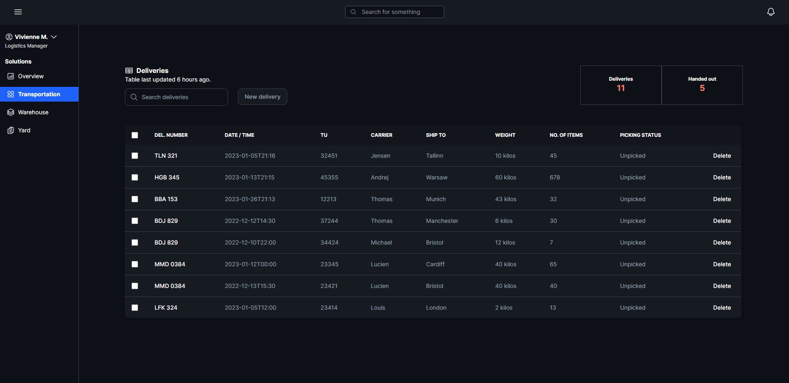

<h1 align="center">
Logistics Management
</h1>

<div align="center">

`Next.js` `Express` `Prisma` `Tailwind` `Radix UI`

</div>




## Run Local

Run the following command in both directories to start the application.

```bash
$ npm run dev
```
